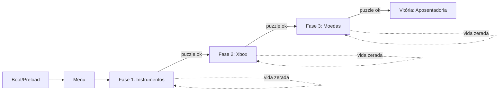
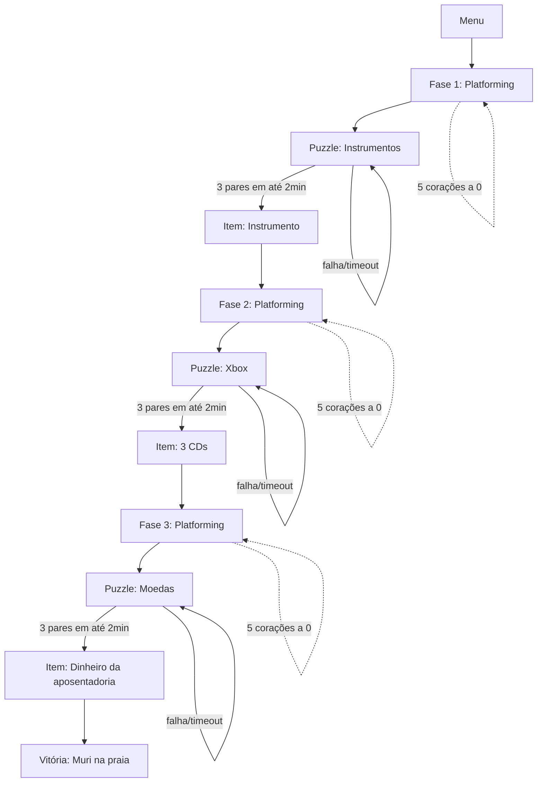

# System Design — Jogo 2D "A Aposentadoria de Muri" (50 anos de Muricarliton)

## 1. Visão geral da arquitetura

Aplicação **client-side pura**, sem backend e sem persistência entre dispositivos: cada convidado joga isoladamente no próprio celular, simultaneamente aos demais, sem qualquer sincronização em rede. O jogo roda 100% no browser (foco em Chrome mobile, orientação landscape), como build estático hospedado na Vercel — mesmo modelo de deploy do convite, mas sem Supabase, já que não há dados para persistir nem autenticação.



Motor escolhido: **Phaser.js 3.x**, pela física de plataforma pronta (Arcade Physics), suporte nativo a tilemaps, sprite atlas/animações e input touch — reduz drasticamente o trabalho de baixo nível dado o prazo do projeto, mantendo TypeScript/Vite como no restante do ecossistema Muricarliton 50 (mesmo que como codebase totalmente separada do convite).

## 2. Stack técnica

| Camada | Escolha |
| --- | --- |
| Package manager | Yarn |
| Build tool | Vite |
| Engine | Phaser.js 3.x |
| Linguagem | TypeScript |
| Física | Phaser Arcade Physics |
| Tilemaps | Formato Tiled (JSON), importado via Phaser Tilemap Loader |
| Áudio | Phaser Sound Manager (arquivos chiptune/nordestino — sanfona/forró 8-bit) |
| Deploy | Vercel (subdomínio automático) |
| Backend | Nenhum — app 100% client-side |

## 3. Arquitetura de cenas (Phaser Scenes)

| Cena | Função |
| --- | --- |
| `BootScene` | Carrega assets essenciais (loading bar) |
| `PreloadScene` | Carrega sprites, tilemaps, áudio de todas as fases |
| `MenuScene` | Tela inicial |
| `Phase1Scene` | Platforming temático em instrumentos |
| `Phase2Scene` | Platforming temático em vídeo games/Xbox |
| `Phase3Scene` | Platforming temático em moedas |
| `PuzzleScene` | Minigame de jogo da memória — sobreposta, pausa a cena de fase ativa |
| `GameOverScene` | Vida zerada — opção de reiniciar a fase atual do zero |
| `VictoryScene` | Final: Muri na praia, com instrumento, aposentadoria e os 3 CDs |

`PuzzleScene` é lançada com `scene.launch` (não `scene.start`) sobre a cena de fase ativa, que fica pausada (`scene.pause`) enquanto o puzzle roda — ao concluir ou não o puzzle, a fase retoma exatamente de onde parou.

## 4. Estrutura de pastas sugerida

```
src/
  scenes/
    BootScene.ts
    PreloadScene.ts
    MenuScene.ts
    Phase1Scene.ts
    Phase2Scene.ts
    Phase3Scene.ts
    PuzzleScene.ts
    GameOverScene.ts
    VictoryScene.ts
  entities/
    Player.ts
    enemies/
      Bat.ts
      WildCat.ts
      Fireball.ts
    thieves/
      Thief.ts            # classe base
      Maryana.ts
      Mayra.ts
      Weruska.ts
  systems/
    PlayerStateMachine.ts
    HealthSystem.ts
    CurrencySystem.ts
    AmmoSystem.ts
    InputController.ts    # abstrai D-pad + botões virtuais
    DialogueSystem.ts
    MemoryPuzzleEngine.ts
  ui/
    VirtualControls.ts
    HeartsHUD.ts
    CoinsHUD.ts
    AmmoHUD.ts
    DialogueBubble.ts
  config/
    gameConfig.ts
    phasesConfig.ts        # tilemap ref, spawns de inimigo/ladra, tema do puzzle, item essencial por fase
  data/
    puzzleThemes/
      instrumentos.ts
      xbox.ts
      moedas.ts
    dialogueLines/
      maryana.ts
      mayra.ts
      weruska.ts
  assets/
    sprites/
    tilemaps/
    audio/
  main.ts
```

## 5. Máquina de estados do personagem (Muri)

Estados: `Idle → Walk → Jump → Crouch → AttackMelee → AttackRanged → Defend → Hurt → Dead`

- **Idle/Walk**: input horizontal do D-pad.
- **Jump**: física de gravidade padrão do Arcade Physics, pulo simples (sem pulo duplo).
- **Crouch**: acionado pelo direcional "baixo"; reduz a hitbox do personagem (esquiva de ataques altos) e permite passar por vãos baixos no tilemap.
- **AttackMelee**: hitbox curta na frente do personagem; derrota qualquer inimigo ambiental em 1 golpe.
- **AttackRanged**: dispara projétil na direção de frente; consome munição limitada (ver §6); derrota inimigo em 1 acerto.
- **Defend**: reduz dano recebido parcialmente; permite movimento simultâneo (não é um estado bloqueante).
- **Hurt**: disparado ao colidir com inimigo ambiental — reduz 1 coração. **Sem knockback, sem i-frames.**
- **Dead**: 0 corações → `GameOverScene`, reinicia a fase atual do zero (sem sistema de vidas/continues).

> **Cooldown técnico de dano**: como não há i-frames, foi definido um cooldown técnico de **~400ms** entre "hits" do mesmo inimigo (sem invencibilidade visual) — evita que um contato contínuo (ex.: parado sobre uma bola de fogo) drene múltiplos corações em poucos frames. Decisão puramente de implementação, sem impacto na experiência percebida pelo jogador.

## 6. Sistema de combate

- **Corpo a corpo**: sem limite de uso, hitbox curta, 1 golpe derrota o inimigo.
- **À distância**: munição **limitada por fase**, recarregada por meio de **pickups espalhados no cenário** (itens coletáveis de munição — sem regeneração automática por tempo).
- **Defesa**: reduz dano parcialmente, personagem pode se mover enquanto bloqueia.
- Inimigos ambientais (morcegos, gatos selvagens, bolas de fogo) **morrem com um único golpe** (corpo a corpo ou à distância) — não têm pontos de vida próprios.
- Nenhuma fase tem chefe (boss) dedicado — apenas inimigos comuns ao longo do percurso.

## 7. Sistema de vida

- **5 corações**, ilustrados na estética Cordel Arcade (traço entalhado/hachura, xilogravura) — não um ícone de coração genérico.
- Perde 1 coração por contato com inimigo ambiental (respeitando o cooldown técnico do §5).
- 0 corações = game over, reinicia a fase atual do zero. Sem sistema de vidas ou continues.

## 8. Inimigos ambientais

| Inimigo | Comportamento |
| --- | --- |
| Morcego | Voa — movimento aéreo, altura variável |
| Gato selvagem | Corre no chão — movimento terrestre |
| Bola de fogo | Trajetória em altura intermediária ("pelo meio" da tela, entre chão e voo alto) |

Todos: 1 hit para derrotar, sem barra de vida própria, causam 1 coração de dano ao personagem por contato. Detalhes finos (velocidade exata, alcance de detecção, se perseguem o jogador ou seguem rota fixa) ficam como ajuste de conteúdo durante o desenvolvimento — não bloqueiam a arquitetura.

## 9. As ladras: Maryana, Mayra e Weruska

Personagens de **contato apenas** — nunca combatidas, apenas evitadas (pular/desviar). Ao colidir com o hitbox de Muri:
1. Desconta a porcentagem correspondente das **moedas comuns coletadas** (ver nota de validação abaixo).
2. Exibe balão de diálogo (`DialogueBubble`), overlay não-bloqueante — o jogo continua rolando normalmente.

| Personagem | % roubada | Falas (sorteio aleatório, sem repetição imediata) |
| --- | --- | --- |
| Maryana | 5% | "Pai, me dâ um carmed!" / "Pai, pera ai..." / "Deixa eu jogar?!" / "Pai, compra um sorvete pra mim?" / "Ô pai, me dá uma grana pro Uber!" |
| Mayra | 15% | "Pai, manda meu PIX!" / "Pai, me dá uma grana pra sair com as amigas?" / "Pai, paga minha viagem!" / "Pai, me empresta uma grana até o dia 5?" / "Pai, compra um perfume pra mim?" |
| Weruska | 30% | "Muri, cadê minha PR?!" / "Bora! Manda o dinheiro da feira." / "O que que tu quer almoçar?" / "Muri, bora comprar carne pra o almoço de domingo?" / "Separa um dinheiro aí pra gente viajar esse mês." |

**Confirmado**: as ladras descontam do placar de **moedas comuns coletadas** (pontuação secundária) — não do item essencial "dinheiro da aposentadoria", que só é obtido via puzzle da Fase 3.

**Frequência de aparição**: aleatória ao longo da fase, com **cooldown individual de 5 minutos por personagem** — ou seja, depois que a Maryana aparece, ela só pode reaparecer 5 min depois, mas isso não impede a Mayra ou a Weruska de aparecerem nesse meio-tempo. Pontos exatos de spawn por fase estão detalhados na proposta de level design (§20).

## 10. Sistema de diálogo

- `DialogueBubble`: componente de UI ancorado à posição da ladra em tela, renderizado por cima da cena sem pausar o jogo.
- Cada personagem tem um array fixo de 5 falas; sorteio aleatório a cada aparição (com lógica simples para evitar repetir a mesma fala duas vezes consecutivas).
- Duração de exibição do balão: **20 segundos**.

## 11. Puzzle — jogo da memória

- Grid de **25 cartas** (5×5), tema varia por fase:
  - **Fase 1**: instrumentos (violão, guitarra, sanfona, etc.)
  - **Fase 2**: vídeo games/Xbox (referências aos CDs — Assassin's Creed, Mass Effect, Batman Arkham — e elementos de console/games)
  - **Fase 3**: moedas
- Objetivo: formar **ao menos 3 pares** dentro do limite de **2 minutos**.
- Falha ou timeout: o puzzle reinicia em loop (embaralha as cartas de novo) até o jogador conseguir — **sem penalidade de vida/coração**, é independente do `HealthSystem` da fase.
- Trigger: implementado como uma zona de colisão fixa no tilemap (ex.: um altar/barraca) — ao entrar nela, `Phase*Scene` é pausada e `PuzzleScene` é lançada como overlay.
- Conclusão do puzzle libera o item essencial daquela fase e desbloqueia o avanço para a próxima.

## 12. Itens essenciais e condição de vitória

| Item essencial | Como é obtido |
| --- | --- |
| Instrumento | Completar Fase 1 (platforming + puzzle de instrumentos) |
| CDs de Xbox (bundle: Assassin's Creed, Mass Effect, Batman Arkham) | Completar Fase 2 (platforming + puzzle de games) — os 3 CDs são obtidos juntos, como um único item |
| Dinheiro / cofre da aposentadoria | Resolver o puzzle da Fase 3 **garante sozinho** a quantia necessária — moedas comuns coletadas ao longo do jogo são só pontuação secundária, sem afetar a condição de vitória |

Vitória = completar as 3 fases em sequência linear (Fase 1 → 2 → 3), reunindo os 3 itens essenciais → `VictoryScene` (Muri se aposenta na praia, toca seu instrumento, com os CDs e o dinheiro conquistados).

## 13. Estrutura de dados das fases (data-driven)

Cada fase é configurada por um objeto de dados (`phasesConfig.ts`), não hardcoded na cena, para facilitar ajustes de conteúdo sem tocar em lógica:

```ts
interface PhaseConfig {
  id: string;
  tilemapKey: string;
  enemySpawns: EnemySpawn[];
  thiefEncounters: ThiefEncounter[];
  puzzleThemeKey: 'instrumentos' | 'xbox' | 'moedas';
  puzzleTriggerZone: { x: number; y: number; width: number; height: number };
  essentialItem: string;
}
```

## 14. Controles virtuais

- **D-pad** (esquerda / direita / baixo=agachar) — canto inferior esquerdo da tela.
- **Botões de ação** — canto inferior direito: Pular, Atacar corpo a corpo, Atacar à distância, Defender.
- Orientação: **landscape obrigatório** (lock de orientação via CSS/JS, com tela de aviso se o dispositivo estiver em portrait).

## 15. Áudio

- Trilha de fundo e efeitos em estilo **chiptune-nordestino** (referências a sanfona/forró em 8-bit).
- SFX mínimos: pulo, moeda, dano (coração perdido), ataque corpo a corpo, ataque à distância, acerto no puzzle, falha no puzzle, vitória de fase, vitória final.

## 16. Pipeline de assets

- Pixel art em **baixa resolução clássica** (32×32 ou 64×64 px) para personagem e inimigos — visual mais retrô/blocado, coerente com "Cordel Arcade" e mais rápido de produzir dado o prazo.
- Sprite sheets por entidade, com frames para: idle, andar, pular, agachar, ataque corpo a corpo, ataque à distância, defender, dano, morte (inimigos).
- Tilemaps em formato Tiled (JSON), um por fase.
- Cartas do puzzle: ilustrações quadradas simples, mesma paleta/traço do restante do jogo.

## 17. Fluxo de jogo (visão geral)



## 18. Pontos em aberto (não bloqueantes para o desenvolvimento)

Todos os pontos de design levantados durante a elaboração deste documento foram resolvidos (ver §5, §6, §8, §9, §10 e a proposta de level design em §20). Itens de ajuste fino que naturalmente só se resolvem durante a implementação/playtests:

- Velocidade exata, alcance de detecção e rotas específicas de cada inimigo ambiental (dentro do padrão de movimento já definido em §8).
- Pontos de spawn de munição de ataque à distância dentro de cada fase (quantidade e posicionamento exatos).
- Ajustes de dificuldade após primeiros playtests (densidade de inimigos, timing dos puzzles).

## 19. Fora de escopo

- Qualquer elemento impresso ou físico.
- Multiplayer/sincronização entre dispositivos — cada convidado joga isoladamente.
- Sistema de vidas/continues, checkpoints intermediários, ou saves entre sessões.
- Chefes (bosses) dedicados por fase.
- Personalização de jogo por convidado (mesma build para todos).

## 20. Proposta inicial de level design (rascunho, sujeito a ajuste)

Progressão de dificuldade crescente entre as 3 fases (Fase 1 introdutória → Fase 3 mais desafiadora), consistente com a jornada narrativa de Muri rumo à aposentadoria.

### Fase 1 — Instrumentos
- **Tom**: introdutória, ritmo mais calmo — primeiro contato do jogador com movimento, combate e puzzle.
- **Comprimento**: curto (percurso de plataforma mais objetivo, sem desvios complexos).
- **Inimigos**: poucos — 3 morcegos, 2 gatos selvagens. Sem bolas de fogo ainda (introduzidas na Fase 2).
- **Munição**: 2 pickups de ataque à distância, bem visíveis no caminho principal.
- **Moedas comuns**: distribuídas ao longo do caminho principal + pequenos desvios opcionais de baixo risco.
- **Ladra**: 1 aparição da **Maryana** (5% — a de menor impacto, serve como introdução suave à mecânica de ladras).
- **Puzzle**: trigger posicionado próximo ao fim do percurso, tema instrumentos.
- **Item essencial liberado**: Instrumento.

### Fase 2 — Vídeo games / Xbox
- **Tom**: dificuldade intermediária — mais obstáculos de plataforma, primeira aparição das bolas de fogo.
- **Comprimento**: médio.
- **Inimigos**: 4 morcegos, 3 gatos selvagens, 2 bolas de fogo.
- **Munição**: 2 pickups, posicionados de forma mais espaçada (exige planejamento do jogador).
- **Moedas comuns**: mais escondidas, algumas exigem desvios com risco (perto de inimigos).
- **Ladra**: **Mayra** (15%) aparece 1–2 vezes ao longo da fase.
- **Puzzle**: trigger próximo ao fim do percurso, tema games/Xbox.
- **Item essencial liberado**: os 3 CDs (Assassin's Creed, Mass Effect, Batman Arkham).

### Fase 3 — Moedas
- **Tom**: fase final, mais desafiadora — clímax antes da praia.
- **Comprimento**: mais longa que as anteriores.
- **Inimigos**: maior densidade dos três tipos combinados (ex.: 5 morcegos, 4 gatos selvagens, 3 bolas de fogo).
- **Munição**: pickups mais espaçados, exigindo uso mais estratégico do ataque à distância.
- **Moedas comuns**: mais abundantes, coerente com o tema "moedas" da fase.
- **Ladra**: **Weruska** (30% — a de maior impacto) aparece 1–2 vezes, reforçando a tensão antes do desfecho.
- **Puzzle**: trigger perto do final do percurso, tema moedas — ao resolver, garante o dinheiro da aposentadoria.
- **Item essencial liberado**: Dinheiro/cofre da aposentadoria → libera `VictoryScene`.

> Esta é uma proposta inicial para orientar o level design — comprimento exato, posicionamento pixel-a-pixel de inimigos/moedas e o tilemap final ficam a critério de quem for produzir o conteúdo de cada fase, usando esta estrutura como ponto de partida.
